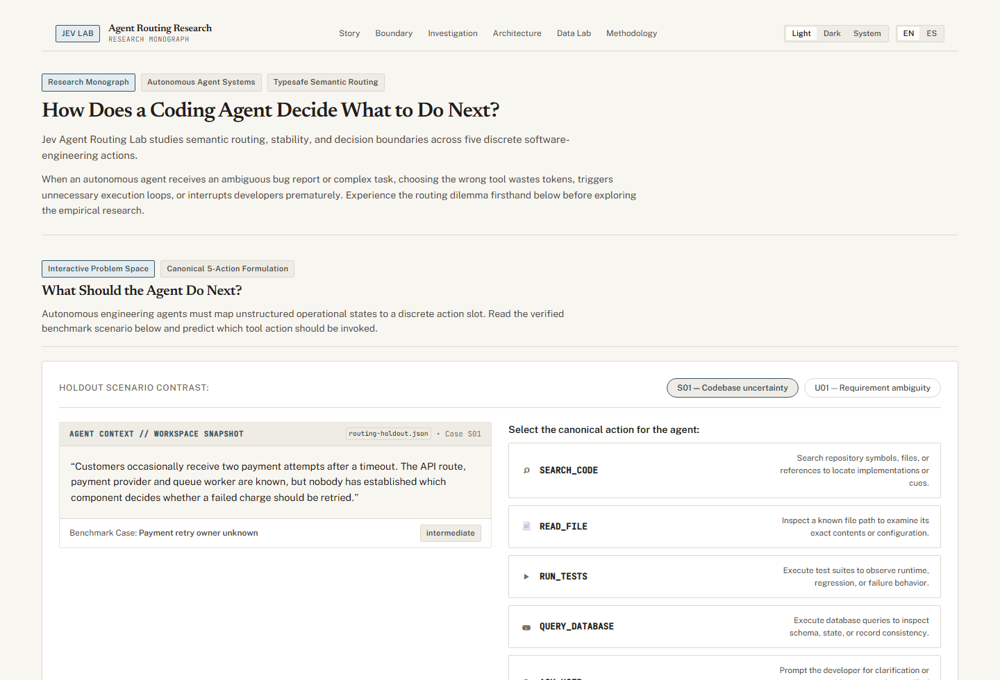
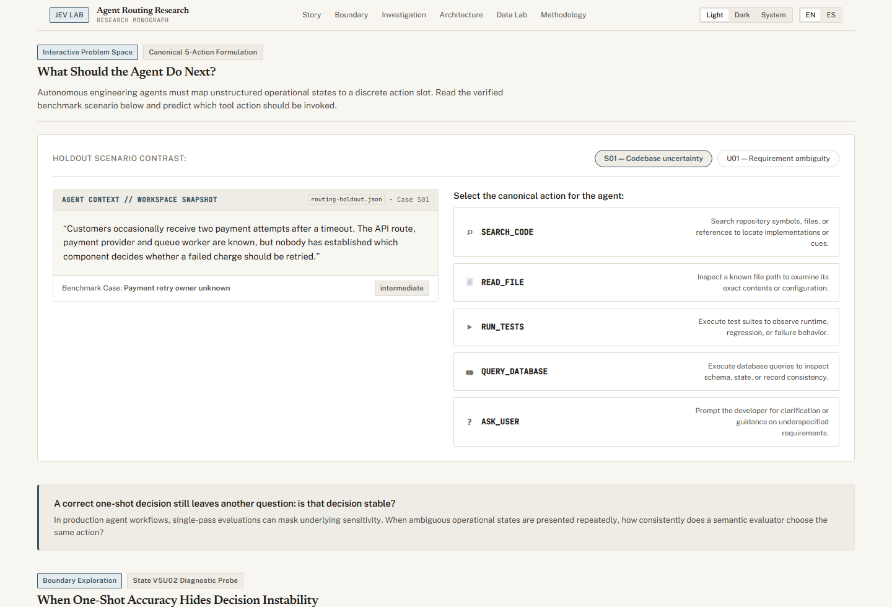
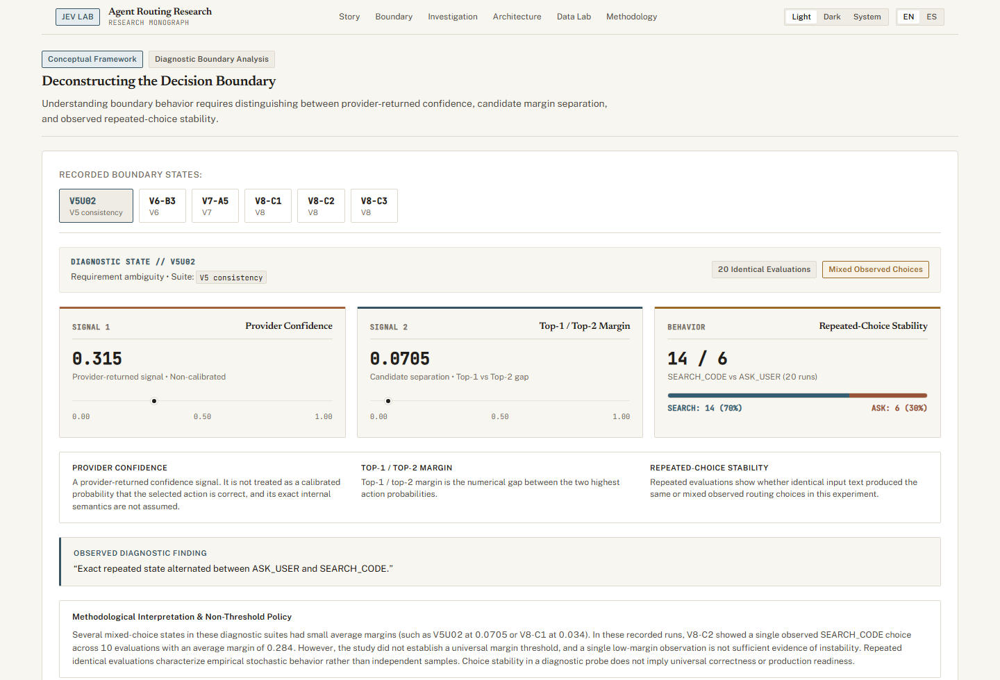
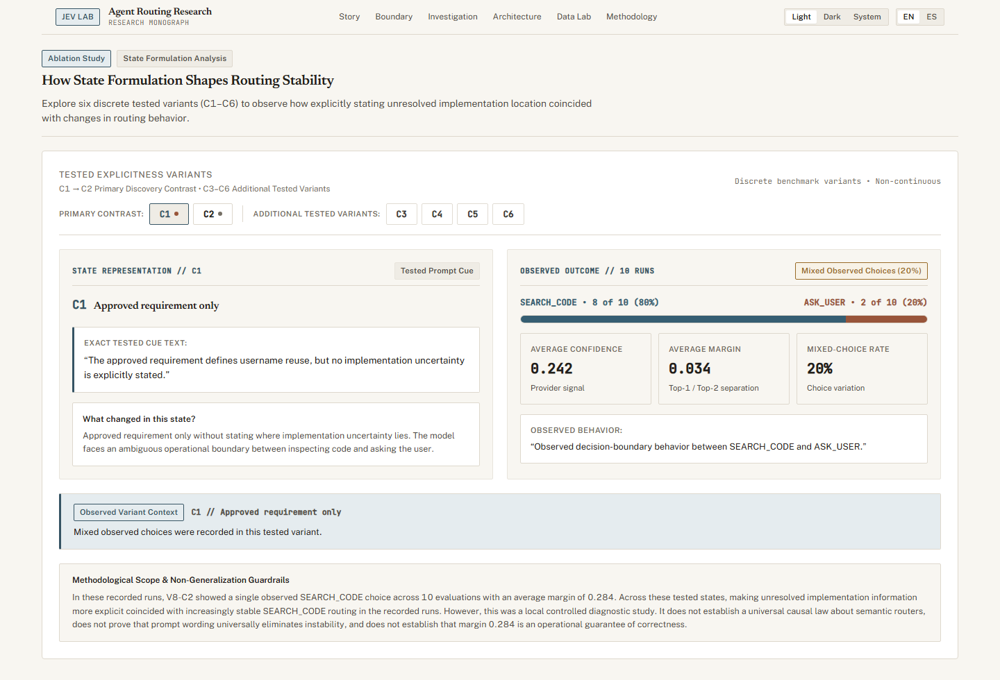
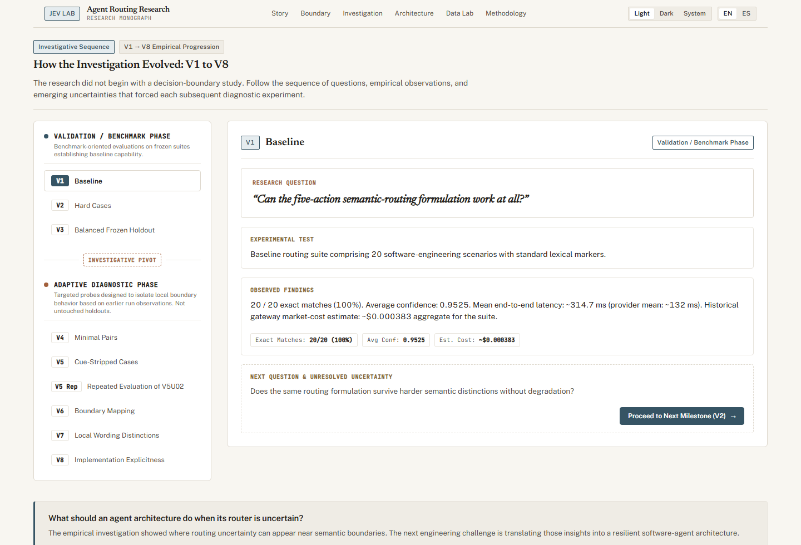
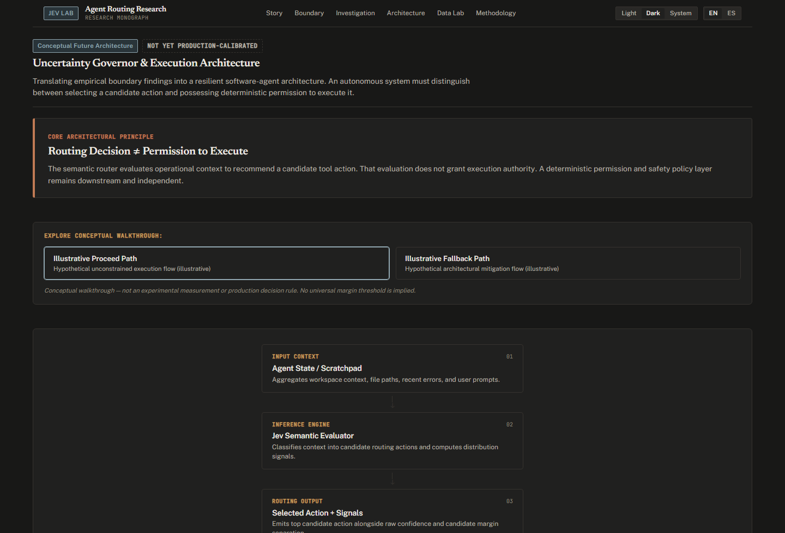
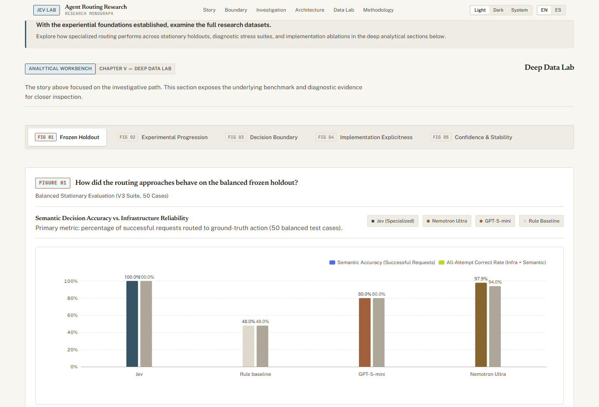
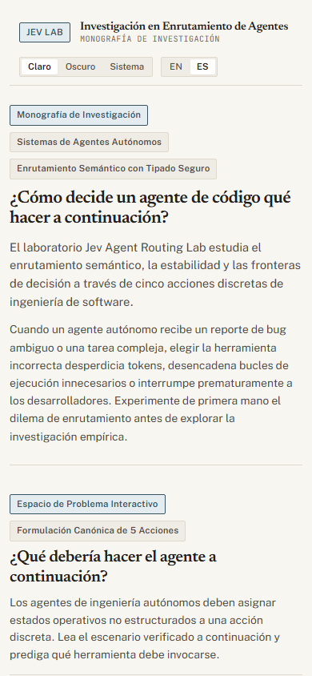

# Jev Agent Routing Lab

**An empirical study of semantic next-action routing for software-engineering agents.** This repository pairs a research record with an interactive monograph. It examines not only whether a router chooses an expected action once, but also how repeated decisions behave near semantic boundaries.

[**Open the live monograph**](https://brayanperezballadares.github.io/jev-agent-routing-lab/) · [Research summary](docs/results-summary.md) · [Methodology](docs/methodology.md) · [Findings](docs/findings.md) · [Experiments](docs/experiments.md)

| Repository | Interface | Languages | Themes |
|---|---|---|---|
| [BrayanperezBalladares/jev-agent-routing-lab](https://github.com/BrayanperezBalladares/jev-agent-routing-lab) | [Live GitHub Pages demo](https://brayanperezballadares.github.io/jev-agent-routing-lab/) | English and Spanish | Light, dark, and system |

> **Research integrity.** Results describe a small, synthetic software-engineering routing task. Repeated runs are empirical, non-independent observations—not population-level estimates. They do not establish causal effects, calibrated correctness probabilities, a universal uncertainty threshold, or production performance.

---

## The question

A coding agent repeatedly has to decide what to do next. Should it search an unfamiliar repository, inspect a known file, run tests, inspect stored data, or ask the user because the requirement itself is unsettled?

This project studies **Jev as a semantic decision router** over a fixed five-action space. Jev evaluates the agent state and returns a structured choice and probability distribution. It does not perform the selected operation or solve the complete programming task.

The progression starts with benchmark validation, then moves into adaptive diagnostics: repeated identical inputs, boundary sweeps, controlled wording changes, and explicitness about unresolved implementation details. The central observation is that one-shot accuracy can conceal variation across repeated evaluations.

## Explore the interactive monograph

The deployed monograph combines the research narrative, historical results, and exploratory views. Its sections guide readers from the routing task through replay and decision boundaries to interpretation and limitations.



### Scenario Sandbox

The sandbox presents the five candidate actions against an agent-state scenario. It is an explanatory interface, not an execution environment: a routing choice is not permission to invoke a real tool.



### Historic Replay

Historic Replay makes saved evaluations inspectable. One example is **V5U02**, a fixed state evaluated 20 times: `SEARCH_CODE` appeared 14 times and `ASK_USER` appeared 6 times. Average confidence was 0.315 and average top-two margin was 0.0705. These are observations from repeated evaluations of the same state, not 20 independent samples.



### Margin Deconstructor and Explicitness Ladder

The monograph provides views for inspecting probability separation and the V8 explicitness cases. V8 held the approved business rule fixed while varying how the unresolved implementation problem was stated.



### Progression Timeline and Uncertainty Governor

The timeline distinguishes the initial benchmark and validation suites (V1–V3) from adaptive diagnostics (V4–V8). The uncertainty governor is conceptual: it presents signals to inspect, not a validated production policy.





### Deep Data Lab

Deep Data Lab provides five focused views:

| View | What it helps inspect |
|---|---|
| **Holdout** | The balanced V3 comparison and its evaluation context |
| **Progression** | How the experiments developed from V1 through V8 |
| **Boundary** | Repeated action distributions around selected boundaries |
| **Explicitness** | V8’s six cases, C1–C6 |
| **Stability** | Repetition, action frequency, and uncertainty measures |



The interface supports English and Spanish, themes, and responsive layouts. The mobile example below uses Spanish and a dark theme.



---

## Routing action space

The benchmark uses five actions with distinct meanings:

| Action | Choose it when… |
|---|---|
| `SEARCH_CODE` | The relevant implementation location is unknown and repository search is the next useful step. |
| `READ_FILE` | A relevant file is known and its contents or behavior need inspection. |
| `RUN_TESTS` | Code has changed and verification is needed. |
| `QUERY_DATABASE` | Persistent records, schema, constraints, or database state may explain the issue. |
| `ASK_USER` | Intended behavior or a requirement is not defined well enough to proceed. |

The action space is deliberately small. It focuses the experiments on next-step distinctions rather than general task completion.

## Experimental progression

The experiment labels describe an evolving investigation, not eight independent benchmark replications.

| Stage | Role in the study | Design |
|---|---|---|
| **V1–V3: benchmark and validation** | Establish baseline behavior and a frozen balanced holdout. | Initial cases, harder semantic distinctions, then a 50-case holdout. |
| **V4: minimal pairs** | Probe whether small semantic changes flip the expected action. | Paired cases across action boundaries. |
| **V5: cue-stripped diagnostics** | Reduce direct lexical cues and inspect controlled uncertainty. | Harder cases and a later repeated evaluation of a fixed state. |
| **V5U02: repeated state** | Revisit one fixed V5 state. | 20 evaluations of the same wording; two actions observed. |
| **V6: boundary sweep** | Gradually change a state around an `ASK_USER` / `SEARCH_CODE` boundary. | Repeated evaluations at B3. |
| **V7: minimal ablation** | Control a wording change while holding the rest of a scenario fixed. | Repeated evaluations at A5. |
| **V8: implementation explicitness** | Study how state representation relates to routing around implementation uncertainty. | Six cases, C1–C6, with the approved business rule held fixed. |

V4–V8 are **adaptive diagnostics** informed by earlier observations, not untouched holdout benchmarks. V5U02 is listed separately because its 20 repetitions are a consistency experiment, not another V5 accuracy denominator.

## Canonical results

### Benchmark and validation

| Suite | Successful requests | Semantic accuracy on successful responses | Correct across all attempts |
|---|---:|---:|---:|
| V1 baseline | 20/20 | 100% | 20/20 |
| V2 hard cases | 30/30 | 100% | 30/30 |
| V3 balanced holdout | 50/50 | 100% | 50/50 |
| V4 minimal pairs | 39/40 | 100% | 39/40 |
| V5 cue-stripped | 39/40 | 100% | 39/40 |

V4 and V5 each had one infrastructure failure. “Semantic accuracy on successful responses” excludes requests that did not return a decision; “correct across all attempts” keeps those failures visible in the full attempt count. Infrastructure failures are not counted as semantic reasoning errors.

### V3 holdout comparison

| Router | Successful requests | Correct decisions | Accuracy on successful responses |
|---|---:|---:|---:|
| Jev | 50/50 | 50/50 | 100% |
| Rule baseline | 50/50 | 24/50 | 48% |
| OpenAI GPT-5-mini | 50/50 | 40/50 | 80% |
| NVIDIA Nemotron Ultra | 48/50 | 47/48 | 97.9% |

Nemotron produced 47 semantically correct decisions among 48 successful responses and 47 correct decisions across all 50 attempts. These results are descriptive context, **not a normalized leaderboard or provider ranking**. Infrastructure, retries, latency measurement, pricing, output parsing, and endpoint availability were not fully normalized across systems.

### Repeated-state diagnostics

| Diagnostic | Repetitions | Observed choices | Average confidence | Average top-two margin |
|---|---:|---|---:|---:|
| V5U02 | 20 | `SEARCH_CODE` 14; `ASK_USER` 6 | 0.315 | 0.0705 |
| V6-B3 | 10 | `SEARCH_CODE` 6; `ASK_USER` 4 | 0.317 | 0.068 |
| V7-A5 | 10 | `SEARCH_CODE` 7; `ASK_USER` 3 | 0.248 | 0.047 |

### V8 explicitness cases

| Case | Repeated choice | Average confidence | Average margin |
|---|---|---:|---:|
| C1 | `SEARCH_CODE` 8/10; `ASK_USER` 2/10 | 0.242 | 0.034 |
| C2 | `SEARCH_CODE` 10/10 | 0.534 | 0.284 |
| C3 | `SEARCH_CODE` 10/10 | 1.000 | 1.000 |
| C4 | `SEARCH_CODE` 10/10 | 0.987 | 0.982 |
| C5 | `SEARCH_CODE` 10/10 | 1.000 | 1.000 |
| C6 | `SEARCH_CODE` 10/10 | 1.000 | 1.000 |

The V8 representation differences coincided with observed differences in consistency and separation in these cases. This does **not** establish causation or generality.

## What the measurements mean

These signals answer different questions:

- **Choice** is the selected action for one response.
- **Confidence** is the evaluator’s reported score. It is not established here as a calibrated probability that the answer is correct.
- **Top-two margin** is `P(top1) − P(top2)` for one returned distribution. A small margin means the leading options are close in that response; it is not a universal instability threshold.
- **Empirical stability** describes how often the same action appeared in repeated runs of a particular state.
- **Infrastructure reliability** describes whether a request returned a usable semantic decision at all.

Repeated identical inputs are **non-independent empirical observations**. A repeated 10/10 outcome describes those runs; it does not provide an independent-sample confidence interval or population-level guarantee. Low margin did not universally predict instability, and confidence alone did not determine whether a repeated state was stable. This repository does not validate an automatic fallback threshold.

## Decision boundary: routing is not permission

A possible architecture separates decision selection from execution:

```text
Current agent state
        │
        ▼
Semantic router ──► action + scores
        │
        ▼
Policy / authorization checks
        │
        ▼
Tool execution (only when independently authorized)
```

**Routing Decision ≠ Permission to Execute.** A router’s `RUN_TESTS` or `QUERY_DATABASE` choice is not authorization to access a machine, repository, database, or external system. An integrating agent still needs its own permission, safety, and policy checks. This architecture is conceptual and has not been validated as a production control system.

## Method and limitations

The routing criteria and five-action semantics were frozen before the later diagnostic experiments. Datasets were not retroactively relabeled to improve observed results. When later evidence raised a new question, the study added diagnostics rather than rewriting earlier cases.

- Scenarios are synthetic and the action space is intentionally narrow.
- V4–V8 were informed by earlier observations; they are adaptive diagnostics, not independent untouched benchmarks.
- Repeated evaluations of the same text are not independent samples.
- Confidence is not shown to be a calibrated correctness probability.
- No universal confidence or margin cutoff is established; low margin does not universally predict instability.
- Provider comparisons are descriptive, with infrastructure, retries, latency, cost, and parsing not fully normalized.
- Provider failures, such as rate limits or service errors, are tracked separately from semantic mistakes.
- Results do not guarantee behavior on real repositories, in production agents, or under changed provider versions.
- V8 representation changes coincided with observed stability differences in these cases; causal impact and generality remain untested.
- The uncertainty-governor and execution-boundary diagrams are conceptual, not validated policy mechanisms.

See [Methodology](docs/methodology.md) for definitions, metrics, dataset freezing, and reproducibility notes; [Findings](docs/findings.md) for interpretation; and the [Results Summary](docs/results-summary.md) for the historical tables.

## Technology

| Area | Technologies |
|---|---|
| Interactive monograph | React 19, TypeScript, Vite |
| Charts | Apache ECharts via `echarts-for-react` |
| Localization | `i18next`, `react-i18next` |
| Research and evaluation | TypeScript, Node.js, Jev, OpenAI-compatible providers |
| Tooling and publication | pnpm, ESLint, GitHub Actions, GitHub Pages |

The README and research documents are not part of the Pages deployment trigger. A docs-only change updates repository documentation but does not itself deploy a new monograph build.

## Repository map

```text
.
├── cases/                 Frozen scenario sets and routing criteria
├── docs/                  Methodology, findings, experiments, and results summary
├── results/               Result artifact documentation; generated JSON is ignored
├── src/                   Research, benchmark, and provider evaluation scripts
├── visualizations/         React monograph and GitHub Pages application
└── README.md               Project overview and entry point
```

## Run locally

### Requirements

- Node.js 24
- pnpm 11 (the Pages workflow pins pnpm 11.27.1)

### Run the monograph

```bash
cd visualizations
pnpm install --frozen-lockfile
pnpm dev
```

To run the checks used for the Pages build:

```bash
pnpm lint
pnpm build
```

### Run research scripts

From the repository root, install the root package dependencies and run scripts defined in `package.json`:

```bash
pnpm install --frozen-lockfile
pnpm typecheck
pnpm benchmark
pnpm rules
```

Provider-backed scripts are separate commands (`pnpm llm`, `pnpm nvidia`, and related smoke scripts). They may contact external providers and require credentials. Inspect the script and provider configuration before running them. Keep credentials in your local environment and **never commit secrets or `.env` files**. `.env.example` is a template, not a credential source.

## Further reading

- [Research results and interpretation](docs/results-summary.md)
- [Experimental methodology](docs/methodology.md)
- [Findings](docs/findings.md)
- [Experiment history](docs/experiments.md)
- [Frozen result-artifact notes](results/README.md)
- [Interactive monograph source](visualizations/)
- [MIT License](LICENSE)

## License

This project is licensed under the [MIT License](LICENSE). Copyright © 2026 Brayan Pérez.
