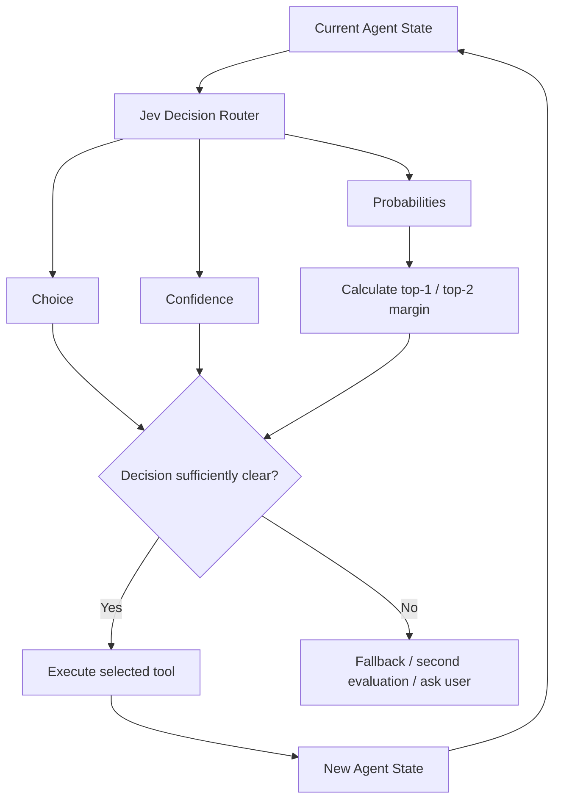

# Jev Agent Routing Lab

## Interactive Dashboard

Explore the live research dashboard:

https://brayanperezballadares.github.io/jev-agent-routing-lab/

Experimental evaluation of **Jev (`typesafe-ai/jev`) as a semantic decision router for software-engineering agents**.

The project studies whether a specialized evaluator can reliably answer a deceptively simple question:

> **What should a coding agent do next?**

Instead of asking a large language model to perform every step of an agent workflow, this repository explores using Jev to route small but important decisions between tools and actions.

---

## Highlights

- Evaluated Jev across progressively harder software-engineering routing scenarios.
- Compared semantic routing against a simple rule-based baseline and general-purpose LLM approaches.
- Tested routing stability by repeating the **exact same state** multiple times.
- Found cases where a correct one-shot answer hid genuine decision instability.
- Investigated semantic decision boundaries between `ASK_USER` and `SEARCH_CODE`.
- Studied `confidence`, returned probabilities, top-1/top-2 margin, empirical instability, and choice entropy.
- Found that explicitly describing **what uncertainty remains unresolved** can dramatically change routing behavior.
- Preserved later experiments without retroactively tuning Jev's routing criteria.

> The main contribution of this project is **not a claim of universal accuracy**.  
> It is an investigation of stability, uncertainty, and semantic decision boundaries in agent routing.

---

## The routing problem

A coding agent repeatedly needs to make micro-decisions such as:

- search the repository
- inspect a known implementation file
- run tests after a code change
- inspect database state
- ask the user when intended behavior is undefined

This project represents those decisions using five actions:

```text
SEARCH_CODE
READ_FILE
RUN_TESTS
QUERY_DATABASE
ASK_USER
```

Jev receives the current agent state and returns a structured decision containing information such as:

```text
choice
probabilities
confidence
```

The returned probability distribution also allows us to calculate the separation between the two most likely actions:

```text
margin = P(top1) - P(top2)
```

---

## Why this matters

A coding agent does not only need intelligence.

It also needs to determine the correct **next operation**.

For example:

```text
State:

The approved requirement says that usernames from deleted
accounts can be reused, but the implementation responsible
for this behavior has not been located.

Decision:

SEARCH_CODE
```

In this architecture, Jev is not the coding agent itself.

It acts as a **semantic routing layer** between the current agent state and the next tool execution.

---

## Architecture



A future production-oriented version can additionally separate:

```text
semantic uncertainty
```

from:

```text
provider / infrastructure failure
```

so that ambiguous decisions and failed API requests are handled differently.

---

## Available actions

| Action | Meaning |
|---|---|
| `SEARCH_CODE` | Search the repository when the relevant implementation location is unknown |
| `READ_FILE` | Inspect a specific implementation file when the relevant file is already known |
| `RUN_TESTS` | Verify code that has already been modified |
| `QUERY_DATABASE` | Inspect persistent records, schema, constraints, or database state |
| `ASK_USER` | Request clarification when intended behavior cannot be determined |

These action definitions were frozen during the later experiments.

The routing criteria were not modified after observing difficult or unstable cases.

---

## Research questions

The project investigates several questions:

1. How accurately can Jev route software-engineering micro-decisions?
2. How stable is the same decision across repeated evaluations?
3. Can one-shot accuracy hide unstable behavior?
4. What happens near semantic decision boundaries?
5. Can confidence and top-1/top-2 probability margin identify uncertainty?
6. How sensitive is routing to small changes in wording?
7. How does a specialized evaluator compare with simple rules and general-purpose LLMs?
8. How should uncertainty be handled before allowing an agent to execute a tool automatically?

---

# Experimental progression

The project evolved progressively rather than starting with the final boundary experiments.

| Version | Experiment | Purpose |
|---|---|---|
| **V1** | Baseline | Initial routing validation |
| **V2** | Hard cases | More difficult semantic distinctions |
| **V3** | Balanced holdout | Evaluate frozen routing logic on a new balanced dataset |
| **V4** | Adversarial minimal pairs | Test whether small semantic changes correctly flip the routed action |
| **V5** | Cue-stripped adversarial suite | Reduce obvious lexical cues and introduce distractors |
| **V5 consistency** | Repeated boundary evaluation | Repeat low-confidence states without changing the input |
| **V6** | Username boundary sweep | Explore the `ASK_USER ↔ SEARCH_CODE` boundary |
| **V7** | Minimal linguistic ablation | Control wording more tightly around the discovered boundary |
| **V8** | Implementation-explicitness ablation | Measure how explicit unresolved implementation information affects routing |

The later experiments are **diagnostic experiments**, not independent untouched holdout benchmarks.

---

# Key results

Detailed historical results are available in:

[`docs/results-summary.md`](docs/results-summary.md)

A few representative observations are shown below.

## Initial benchmark phase

The early experiments produced strong one-shot routing performance.

That result motivated a harder question:

> Was high benchmark accuracy enough to conclude that routing was reliable?

The later experiments showed that the answer is **no**.

---

## One-shot accuracy can hide instability

A particularly important case initially produced the expected action:

```text
ASK_USER
```

However, when the **exact same input** was evaluated repeatedly, Jev alternated between:

```text
ASK_USER
SEARCH_CODE
```

This showed that a single correct benchmark response could hide a state positioned near a semantic decision boundary.

---

## Repeated boundary behavior

Several later experiments reproduced this pattern.

Representative repeated states included distributions such as:

```text
ASK_USER      6/20
SEARCH_CODE  14/20
```

and:

```text
ASK_USER      4/10
SEARCH_CODE   6/10
```

These results motivated a deeper investigation into probability separation and agent-state wording.

---

## V8: implementation explicitness

One of the clearest experiments kept the approved product requirement fixed while changing only how clearly the unresolved implementation problem was described.

### C1 — approved requirement only

```text
The current approved requirement says that
the username becomes available again.
```

Repeated routing remained close to the decision boundary:

```text
SEARCH_CODE  8/10
ASK_USER     2/10
```

The average top-1/top-2 margin was very small.

---

### C2 — implementation not discussed

Adding:

```text
The implementation is not discussed.
```

produced:

```text
SEARCH_CODE 10/10
```

The routing became empirically stable, although meaningful probability mass remained on `ASK_USER`.

---

### C3 — implementation location explicitly unclear

Adding:

```text
It is unclear where this behavior is implemented.
```

produced strongly separated routing:

```text
SEARCH_CODE 10/10
```

with the returned distribution strongly concentrated on `SEARCH_CODE` in the tested runs.

---

## Main semantic observation

The later experiments suggest that the evaluator responds not only to:

```text
What is the desired behavior?
```

but also to:

```text
What information is still missing?
```

Consider:

```text
Requirement known
```

That may still leave several possible next actions.

But:

```text
Requirement known
+
implementation location unknown
```

gives the router a much clearer operational problem:

```text
SEARCH_CODE
```

This distinction is important for agent design because the quality of the **agent state representation** directly affects routing quality.

---

# Confidence is not accuracy

One of the strongest lessons from the project is:

```text
low confidence != incorrect
```

and:

```text
high confidence != universally correct
```

Confidence should not be interpreted as a calibrated probability that a routing decision is correct.

Some lower-confidence states were completely stable across repeated runs.

Other lower-confidence states genuinely alternated between actions.

---

## Probability margin

The experiments therefore also track:

```text
margin = P(top1) - P(top2)
```

For example:

```text
SEARCH_CODE  0.39
ASK_USER     0.38

margin = 0.01
```

The two actions are almost tied.

Compare that with:

```text
SEARCH_CODE  0.98
ASK_USER     0.01

margin = 0.97
```

The first action is strongly separated from the alternative.

In the tested boundary families, very small margins frequently appeared in genuinely unstable states.

However:

> This is an empirical observation from this project, not a universally calibrated production threshold.

---

## Empirical stability

Repeated experiments also distinguish between the evaluator's internal uncertainty and the actual observed stability of its choices.

For example, a state can produce:

```text
SEARCH_CODE 10/10
```

while still assigning substantial probability to another action.

That state is:

```text
empirically stable
```

but not necessarily:

```text
internally certain
```

These are different properties.

---

## Instability rate

For repeated experiments:

```text
dominantChoiceRate =
max(action counts) / successful runs
```

and:

```text
instabilityRate =
1 - dominantChoiceRate
```

Example:

```text
SEARCH_CODE = 7
ASK_USER    = 3
```

produces:

```text
dominantChoiceRate = 0.70
instabilityRate    = 0.30
```

---

## Choice entropy

The later experiment runners also calculate empirical choice entropy.

A deterministic result:

```text
10 / 0
```

has:

```text
entropy = 0
```

A more balanced distribution produces greater entropy.

This gives another way to describe instability without relying exclusively on Jev's own confidence value.

---

# Proposed agent policy

The long-term goal is **not** to blindly execute every Jev decision.

A safer architecture is:

```ts
const decision = await evaluate(state)

const margin =
  decision.top1Probability -
  decision.top2Probability

if (decisionIsAmbiguous(decision, margin)) {
  return fallback()
}

return execute(decision.choice)
```

Possible fallback strategies include:

```text
second evaluation
general-purpose model
human clarification
safe abstention
```

Any threshold used here must be calibrated on the target domain.

Values observed in this repository should not be treated as universal production thresholds.

---

# Reliability vs semantic correctness

The experiments distinguish two different types of failure.

## Semantic routing error

The evaluator successfully returns a decision but selects an action that does not match the benchmark label.

## Infrastructure failure

The evaluator does not successfully produce a semantic decision.

Examples observed during testing included:

```text
HTTP 429
HTTP 503
provider overload
timeouts
```

These should not automatically be counted as semantic reasoning failures.

A real agent needs independent handling for:

```text
semantic uncertainty
```

and:

```text
infrastructure reliability
```

Possible infrastructure handling includes:

```text
retry
fallback provider
circuit breaker
temporary abstention
```

---

# Comparators

Jev was not evaluated in isolation.

The project also contains experiments with:

- deterministic keyword/rule routing
- a general-purpose OpenAI model
- NVIDIA Nemotron Ultra through NVIDIA NIM

Relevant implementation files include:

```text
src/rules.ts
src/rules-benchmark.ts

src/llm.ts
src/llm-benchmark.ts

src/nvidia-llm.ts
src/nvidia-benchmark.ts
```

These comparisons provide useful context, but they are **not perfectly equivalent benchmarks**.

Differences include:

```text
provider infrastructure
retry behavior
latency measurement
pricing methodology
output formatting
endpoint availability
```

The repository therefore does not present them as a perfectly normalized model leaderboard.

---

# Repository structure

```text
jev-agent-routing-lab/
│
├── cases/
│   ├── consistency.json
│   ├── routing-baseline.json
│   ├── routing-hard.json
│   ├── routing-holdout.json
│   ├── routing-v4-minimal-pairs.json
│   ├── routing-v5-cue-stripped.json
│   ├── routing-v6-username-boundary.json
│   ├── routing-v7-minimal-ablation.json
│   └── routing-v8-implementation-explicitness.json
│
├── docs/
│   ├── experiments.md
│   ├── findings.md
│   ├── methodology.md
│   └── results-summary.md
│
├── results/
│   └── README.md
│
├── src/
│   ├── benchmark.ts
│   ├── consistency.ts
│   ├── jev.ts
│   │
│   ├── rules.ts
│   ├── rules-benchmark.ts
│   │
│   ├── llm.ts
│   ├── llm-smoke.ts
│   ├── llm-benchmark.ts
│   │
│   ├── nvidia-llm.ts
│   ├── nvidia-smoke.ts
│   ├── nvidia-benchmark.ts
│   ├── nvidia-model-probe.ts
│   ├── nvidia-ultra-stability.ts
│   │
│   ├── v4-focus-consistency.ts
│   ├── v5-boundary-consistency.ts
│   ├── v6-boundary-sweep.ts
│   ├── v7-minimal-ablation.ts
│   ├── v8-implementation-explicitness.ts
│   │
│   ├── smoke.ts
│   └── types.ts
│
├── .env.example
├── .gitattributes
├── .gitignore
├── package.json
├── pnpm-lock.yaml
├── pnpm-workspace.yaml
├── README.md
└── tsconfig.json
```

---

# Documentation

The research is separated into several documents.

### Methodology

[`docs/methodology.md`](docs/methodology.md)

Covers:

```text
experimental design
action definitions
dataset freezing
metrics
latency methodology
cost methodology
semantic vs infrastructure failures
limitations
```

### Findings

[`docs/findings.md`](docs/findings.md)

Explains the main observations discovered across the experiments.

### Experiment history

[`docs/experiments.md`](docs/experiments.md)

Documents how the project evolved from baseline routing to boundary analysis.

### Results summary

[`docs/results-summary.md`](docs/results-summary.md)

Contains the main historical quantitative results without requiring users to rerun every paid or rate-limited API experiment.

### Generated results

[`results/README.md`](results/README.md)

Explains how local result artifacts are generated and why raw benchmark JSON files are not committed.

---

# Setup

## Requirements

Recommended environment:

```text
Node.js 22+
pnpm
```

The project has been developed and tested using a modern Node.js environment.

---

## Install dependencies

```bash
pnpm install
```

---

## Environment variables

Create:

```text
.env
```

using:

```text
.env.example
```

as the template.

Example:

```env
AI_GATEWAY_API_KEY=your_vercel_ai_gateway_key
NVIDIA_API_KEY=your_nvidia_api_key
```

`AI_GATEWAY_API_KEY` is required for Jev experiments through the Vercel AI Gateway.

`NVIDIA_API_KEY` is required only for NVIDIA comparator experiments.

Never commit:

```text
.env
API keys
tokens
credentials
```

---

# Verification

Run TypeScript validation:

```bash
pnpm typecheck
```

---

## Main benchmark

```bash
pnpm benchmark
```

---

## Rule baseline

```bash
pnpm rules
```

---

## General-purpose LLM comparator

```bash
pnpm llm
```

---

## NVIDIA comparator

```bash
pnpm nvidia
```

---

# Diagnostic experiments

The later diagnostic experiments can be executed directly.

## V4 focused consistency

```bash
pnpm exec tsx src/v4-focus-consistency.ts
```

## V5 boundary consistency

```bash
pnpm exec tsx src/v5-boundary-consistency.ts
```

## V6 boundary sweep

```bash
pnpm exec tsx src/v6-boundary-sweep.ts
```

## V7 minimal ablation

```bash
pnpm exec tsx src/v7-minimal-ablation.ts
```

## V8 implementation explicitness

```bash
pnpm exec tsx src/v8-implementation-explicitness.ts
```

Generated result JSON files are written locally to:

```text
results/
```

They are intentionally ignored by Git.

---

# Reproducibility principles

Several practices were followed to reduce retrospective tuning.

Once a diagnostic experiment had been executed:

```text
states were not rewritten
expected labels were not changed based on outcomes
routing criteria were not tuned
```

If a previous scenario appeared insufficiently controlled, a **new experiment** was created instead of modifying the old result.

This produced the progression:

```text
baseline
   ↓
hard cases
   ↓
holdout
   ↓
minimal pairs
   ↓
cue-stripped cases
   ↓
repeated consistency
   ↓
boundary sweep
   ↓
linguistic ablation
   ↓
implementation explicitness
```

---

# Limitations

This repository does **not** demonstrate universal Jev performance.

Important limitations include:

- synthetic software-engineering scenarios
- a deliberately small action space
- datasets authored specifically for this research
- later diagnostic suites designed after observing earlier behavior
- limited repeated samples per state
- repeated calls to identical text are not independent samples
- provider and gateway variability
- hosted model behavior may change over time
- latency measurements are affected by infrastructure and retry behavior
- provider-specific cost measurements are not perfectly comparable

The results should therefore be interpreted as evidence about the investigated routing setting, not as a general benchmark of all agent tasks.

---

# What this project does not claim

The experiments do not establish that:

```text
Jev has universal 100% accuracy
```

or:

```text
confidence is a calibrated probability of correctness
```

or:

```text
one probability-margin threshold works for every domain
```

or:

```text
Jev is universally superior to general-purpose LLMs
```

The evidence supports a narrower conclusion:

> Repeated evaluation and probability-distribution analysis can reveal meaningful semantic routing boundaries that one-shot accuracy alone may hide.

---

# Next phase

The research phase is now largely complete.

The next step is to move from controlled evaluation to a real agent loop.

The planned agent will expose tools such as:

```text
search_code()
read_file()
run_tests()
query_database()
ask_user()
```

Conceptually:

```text
User task
    ↓
Agent constructs state
    ↓
Jev routes next action
    ↓
Uncertainty gate
    ↓
Tool execution
    ↓
New state
    ↓
Jev routes again
```

The next phase will investigate:

```text
real repository interaction
multi-step routing
uncertainty gating
fallback models
provider failures
safe execution
agent-state construction
```

---

# Project status

```text
Research experiments
V1–V8
✅ Completed
```

Current stage:

```text
documentation and reproducibility
✅ In progress
```

Next:

```text
real coding-agent integration
uncertainty gate
fallback routing
live demonstration
```

---

# Security

Real credentials are never committed to the repository.

The following are intentionally ignored:

```text
.env
generated result JSON files
node_modules
build output
```

Use `.env.example` only as a template.

---

# Contributions and discussion

This project is experimental research.

Issues, reproductions, alternative routing cases, critiques of the methodology, and independent experiments are welcome.

When proposing new benchmark cases, prefer creating a new version or diagnostic suite instead of retroactively modifying previously executed datasets.

---

# Final perspective

The initial question was:

> Can Jev correctly choose the next action for a coding agent?

The experiments eventually produced a more interesting question:

> **When should an agent trust that routing decision enough to act automatically?**

That distinction — between obtaining a decision and understanding its uncertainty — is the direction this project will explore next.
